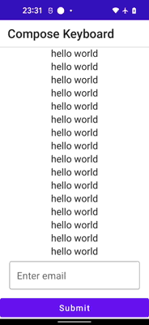

# Jetpack Compose Keyboard

A simple Jetpack Compose app that aims at making an accessible experience when working with text fields. 

This utilizes the [Accompanist Inset API](https://google.github.io/accompanist/insets/) in order to get callback of the window insets when the keyboard is opened/closed. 

